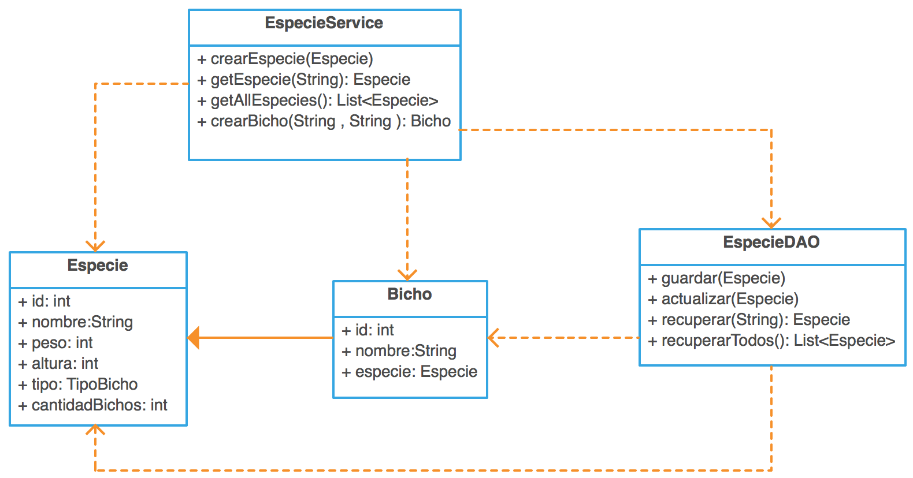

## Entrega 1 - JDBC

¡Es necesario empezar a modelar los bichomones! La prioridad es tener un módulo de administración donde puedan configurarse las especies de bichos que existen con sus propiedades básicas (nombre, peso, altura, tipo) y donde puedan crearse nuevos bichos pertenecientes a cada especie.

El líder del equipo de frontend se reúne con nosotros y nos muestra una interfaz:

Nos comenta que su equipo ya se encuentra bastante adelantado, llevan trabajando semanas contra una implementación mock de dicha interfaz y ya tienen la ui casi lista, pero es hora de hacer una implementación verdadera para dicho dao. 

La interfaz `EspecieDAO` declara los siguientes métodos que nosotros debemos implementar:

- `void guardar(Especie especie)` - Recibe un objeto `Especie` y se encarga de persistirlo en la base de datos.  Tener en cuenta que el nombre de cada especie debe ser único para toda la aplicación.

- `void actualizar(Especie especie)` - Actualiza la `Especie` recibida por parámetro.

- `Especie recuperar(String nombreEspecie)` - este método devolverá la `Especie` cuyo nombre sea igual al provisto por parámetro.  Se espera que este método devuelva, a lo sumo, un solo resultado.

- `List<Especie> recuperarTodos()` - este método deberá devolver una lista de todas las especies existentes ordenadas alfabéticamente por su nombre en forma ascendente.

Adicionalmente, el equipo de frontend ha realizado unos tests de integración que tienen como fin comprobar que nuestro `EspecieService` funciona como ellos esperan.  En dichos tests ellos están haciendo uso de la siguiente interfaz, para la cual también deberemos proveer una implementación:

  

La interfaz `DataService` entiende dos mensajes:

- `void deleteAll()` - se espera que tras ejecutarse esto se elimine toda la información persistida en la base de datos, de manera de poder comenzar el siguiente tests desde cero.

- `void crearSetDatosIniciales()` - crea un set de datos iniciales (de momento solo objetos `Especie`) para facilitar las pruebas de frontend.

### Se pide:
- Que provean implementaciones para las interfaces descriptas anteriormente, haciendo uso de todo lo visto en clase.
- Asignen propiamente las responsabilidades a todos los objetos intervinientes, discriminando entre servicios, DAOs y objetos de negocio.
- Creen test unitarios para cada unidad de código entregada que prueben todas las funcionalidades pedidas, con casos favorables y desfavorables. Si quieren van a poder probar la aplicación utilizando la UI provista, pero **deben** hacer test unitarios de cualquier forma.
- Provean un archivo .sql con las sentencias DDL que sean necesarias para crear el schema de la base de datos (create tables).

### Recuerden que:
- No pueden modificar las interfaces `EspecieDAO` y `DataService`, solo implementarlas.
- Pueden agregar nuevos métodos y atributos a los objetos `Especie` y `Bicho`, pero no eliminar o renombrar atributos / métodos ya provistos.

### UI
Pueden levantar la UI de la aplicación por medio de maven ejecutando el siguiente comando `mvn jetty:run`. Después de eso la aplicación quedará corriendo en la siguiente url `http://localhost:8080/main.html`. Recuerden que la UI no está terminada, por lo que tiene muchos pendientes (pero pueden usarla para darse una idea de que se trata la cosa)
